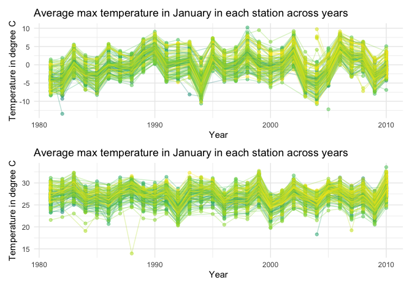

Homework 3
================
Yuanxin Zhang

This is my solution to Homework 3.

# Question 1

### Part 1: Write a short description of the dataset

Note the size and structure of the data, describing some key variables,
and giving illustrative examples of observations.

``` r
data("instacart")
```

This dataset contains 1384617 rows and 15 columns. Observations are the
level of items in orders by user. There are user / order variables –
user ID, order ID, order day, and order hour. There are also item
variables – name, aisle, department, and some numeric codes.

### Part 2: Do or answer the following questions

1)  How many aisles are there, and which aisles are the most items
    ordered from?

<!-- end list -->

``` r
instacart %>% 
    count(aisle) %>% 
    arrange(desc(n))
```

    ## # A tibble: 134 x 2
    ##    aisle                              n
    ##    <chr>                          <int>
    ##  1 fresh vegetables              150609
    ##  2 fresh fruits                  150473
    ##  3 packaged vegetables fruits     78493
    ##  4 yogurt                         55240
    ##  5 packaged cheese                41699
    ##  6 water seltzer sparkling water  36617
    ##  7 milk                           32644
    ##  8 chips pretzels                 31269
    ##  9 soy lactosefree                26240
    ## 10 bread                          23635
    ## # … with 124 more rows

There are 134 aisles. Most items are ordered from fresh vegetables
aisle.  

2)  Make a plot that shows the number of items ordered in each aisle,
    limiting this to aisles with more than 10000 items ordered. Arrange
    aisles sensibly, and organize your plot so others can read it.

<!-- end list -->

``` r
instacart %>% 
    count(aisle) %>% 
    filter(n > 10000) %>%
    mutate(
        aisle = factor(aisle),
        aisle = fct_reorder(aisle, n)
    ) %>%
    ggplot(aes(x = aisle, y = n)) + 
    geom_point() + 
    theme(axis.text.x = element_text(angle = 90, vjust = 0.5, hjust = 1))
```


Top three aisles with the most items are fresh vegetables, fresh fruits
and packaged vegetables/fruits.  

3)  Make a table showing the three most popular items in each of the
    aisles “baking ingredients”, “dog food care”, and “packaged
    vegetables fruits”. Include the number of times each item is ordered
    in your table.

<!-- end list -->

``` r
instacart %>% 
    filter(aisle %in% c("baking ingredients", "dog food care", "packaged vegetables fruits")) %>% 
    group_by(aisle) %>% 
    count(product_name) %>%
    mutate(rank = min_rank(desc(n))) %>% 
    filter(rank < 4) %>% 
    arrange(aisle, rank) %>% 
    knitr::kable()
```

| aisle                      | product\_name                                 |    n | rank |
| :------------------------- | :-------------------------------------------- | ---: | ---: |
| baking ingredients         | Light Brown Sugar                             |  499 |    1 |
| baking ingredients         | Pure Baking Soda                              |  387 |    2 |
| baking ingredients         | Cane Sugar                                    |  336 |    3 |
| dog food care              | Snack Sticks Chicken & Rice Recipe Dog Treats |   30 |    1 |
| dog food care              | Organix Chicken & Brown Rice Recipe           |   28 |    2 |
| dog food care              | Small Dog Biscuits                            |   26 |    3 |
| packaged vegetables fruits | Organic Baby Spinach                          | 9784 |    1 |
| packaged vegetables fruits | Organic Raspberries                           | 5546 |    2 |
| packaged vegetables fruits | Organic Blueberries                           | 4966 |    3 |

Top 3 popular items from baking ingredients are Light Brown Sugar, Pure
Baking Soda and Cane Sugar; top 3 popular items from dog food care are
Snack Sticks Chicken & Rice Recipe Dog Treats, Organix Chicken & Brown
Rice Recipe and Small Dog Biscuits; top 3 popular items from packaged
vegetables fruits are Organic Baby Spinach, Organic Raspberries and
Organic Blueberries.  

4)  Make a table showing the mean hour of the day at which Pink Lady
    Apples and Coffee Ice Cream are ordered on each day of the week;
    format this table for human readers (i.e. produce a 2 x 7 table).

<!-- end list -->

``` r
instacart %>% 
    filter(product_name %in% c("Pink Lady Apples", "Coffee Ice Cream")) %>% 
    group_by(product_name, order_dow) %>% 
    summarize(mean_hour = mean(order_hour_of_day)) %>% 
    pivot_wider(
        names_from = order_dow,
        values_from = mean_hour
    ) %>% 
    knitr::kable()
```

    ## `summarise()` regrouping output by 'product_name' (override with `.groups` argument)

| product\_name    |        0 |        1 |        2 |        3 |        4 |        5 |        6 |
| :--------------- | -------: | -------: | -------: | -------: | -------: | -------: | -------: |
| Coffee Ice Cream | 13.77419 | 14.31579 | 15.38095 | 15.31818 | 15.21739 | 12.26316 | 13.83333 |
| Pink Lady Apples | 13.44118 | 11.36000 | 11.70213 | 14.25000 | 11.55172 | 12.78431 | 11.93750 |

By looking at table of the mean hour of the day at which products are
ordered, Pink Lady Apples are order earlier than Coffee Ice Cream in a
day for each day of the day.

# Question 2

### Part 1: Read and clean accelerometers data

Final dataset should include all originally observed variables and
values; have useful variable names; include a weekday vs weekend
variable; and encode data with reasonable variable classes.

``` r
accel_df = 
    read_csv(
        "./data/accel_data.csv") %>% 
  pivot_longer(
    activity.1:activity.1440,
    names_to = "minute",
    names_prefix = "activity.",
    values_to = "activity"
  ) %>% 
  mutate(
    weekday = case_when(
      day %in% c("Monday","Tuesday","Wednesday","Thursday","Friday") ~ "weekday",
      day %in% c("Saturday","Sunday") ~ "weekend",
      TRUE ~ ""
    ),
    minute = as.numeric(minute),
    day = factor(day),
    day = forcats::fct_relevel(day, c("Monday","Tuesday","Wednesday","Thursday","Friday","Saturday", "Sunday")),
    weekday = factor(weekday)
  )
```

    ## Parsed with column specification:
    ## cols(
    ##   .default = col_double(),
    ##   day = col_character()
    ## )

    ## See spec(...) for full column specifications.

This dataset contains 50400 rows and 6 columns. It is from five weeks of
accelerometer data collected on a 63 year-old male with BMI 25, who was
admitted to the Advanced Cardiac Care Center of Columbia University
Medical Center and diagnosed with congestive heart failure (CHF).
Variables include week (identifier of week), day\_id, day (Monday to
Sunday), minute (1440 minutes a day), weekday (weekday vs weekend) and
activity, which is the activity count for each minute of a 24-hour day
starting at midnight.

### Part 2: Create a table showing the total activity for each day

``` r
accel_df %>% 
    group_by(week, day) %>% 
    summarise(total_activity = sum(activity)) %>%
    pivot_wider(
        names_from = day,
        values_from = total_activity
    ) %>% 
    knitr::kable()
```

    ## `summarise()` regrouping output by 'week' (override with `.groups` argument)

| week |    Monday |  Tuesday | Wednesday | Thursday |   Friday | Saturday | Sunday |
| ---: | --------: | -------: | --------: | -------: | -------: | -------: | -----: |
|    1 |  78828.07 | 307094.2 |    340115 | 355923.6 | 480542.6 |   376254 | 631105 |
|    2 | 295431.00 | 423245.0 |    440962 | 474048.0 | 568839.0 |   607175 | 422018 |
|    3 | 685910.00 | 381507.0 |    468869 | 371230.0 | 467420.0 |   382928 | 467052 |
|    4 | 409450.00 | 319568.0 |    434460 | 340291.0 | 154049.0 |     1440 | 260617 |
|    5 | 389080.00 | 367824.0 |    445366 | 549658.0 | 620860.0 |     1440 | 138421 |

In overall, the participant was more active in weekdays compared to
weekends and had two very low total activity counts on the Saturday of
Week 4 and Week 5. Total activity counts for Tuesday, Wednesday and
Thursday is comparably consistent across weeks.

### Part 3: Make a single-panel plot that shows the 24-hour activity time courses for each day

``` r
  accel_df %>% 
  ggplot(aes(x = minute, y = activity, color = day, group = day_id)) + 
  geom_point(alpha = 0.3) + 
  geom_line(alpha = 0.3) + 
  geom_smooth(aes(group = day), se = FALSE) + 
  theme(legend.position = "bottom") +
  labs(
    title = "Activity counts for each minute starting at midnight for each day",
    x = "Minute of a day",
    y = "Activity counts"
  )
```

    ## `geom_smooth()` using method = 'gam' and formula 'y ~ s(x, bs = "cs")'


In overall, the participant is started to get active around 5-6 am on
each day, indicating this person wake up around this time. This
participant is particularly active around noon on Sunday and around 9pm
on Friday.

# Question 3

### Part 1: Read and clean ny\_noaa data

``` r
data("ny_noaa")
ny_noaa = ny_noaa %>%
  separate(date, into = c("year", "month", "day"), convert = TRUE) %>%
  mutate(tmax = as.numeric(tmax)/10,
         tmin = as.numeric(tmin)/10,
         prcp = prcp/10,
         )
summary(pull(ny_noaa, snow))
```

    ##    Min. 1st Qu.  Median    Mean 3rd Qu.    Max.    NA's 
    ##     -13       0       0       5       0   10160  381221

This dataset contains 2595176 rows and 9 columns. It contains records
for all New York state weather stations from January 1, 1981 through
December 31, 2010. NCEI provides numerous daily variables, including
maximum and minimum temperature, total daily precipitation, snowfall,
and snow depth. There are 145838 missing data in precipitation (mm),
381221 missing data in snowfall(mm), 591786 missing data in snow
depth(mm), 1134358 missing data in maximum temperature (degrees C) and
1134420 missing data in minimum temperature (degrees C). Hence, there
will be a great loss of data if we omit all record with missing data.

For snowfall, the most commonly observed values are 0 because it only
happens at low enough temperature and humidity.

### Part 2: Two-panel plot showing the average max temperature in January and in July in each station across years

``` r
max_jan = ny_noaa %>% 
  filter(month == 1) %>% 
  group_by(id, year, month) %>% 
  summarise(tmax_avg = mean(tmax, na.rm = TRUE)) %>% 
  ggplot(aes(x = year, y = tmax_avg, color = id, group = id)) +
  geom_point(alpha = 0.5) +
  geom_path(alpha = 0.3) +
  theme(legend.position = "none") +
  labs(
    title = "Average max temperature in January in each station across years",
    x = "Year",
    y = "Average max temperature in degree C"
  )
```

    ## `summarise()` regrouping output by 'id', 'year' (override with `.groups` argument)

``` r
 max_jul = ny_noaa %>% 
  filter(month == 7) %>% 
  group_by(id, year, month) %>% 
  summarise(tmax_avg = mean(tmax, na.rm = TRUE)) %>% 
  ggplot(aes(x = year, y = tmax_avg, color = id, group = id)) +
  geom_point(alpha = 0.5) +
  geom_path(alpha = 0.3) +
  theme(legend.position = "none") +
  labs(
    title = "Average max temperature in January in each station across years",
    x = "Year",
    y = "Average max temperature in degree C"
  )
```

    ## `summarise()` regrouping output by 'id', 'year' (override with `.groups` argument)

``` r
 max_jan / max_jul
```

    ## Warning: Removed 2923 rows containing missing values (geom_point).

    ## Warning: Removed 2905 row(s) containing missing values (geom_path).

    ## Warning: Removed 3047 rows containing missing values (geom_point).

    ## Warning: Removed 3027 row(s) containing missing values (geom_path).



The average max temperature in January usually fluctuate between -10 and
10 degree C. Temperature in 1994 and 2004 seem to be lower than other
years. The average max temperature in July usually fluctuate between 20
and 30 degree C. This fluctuation of temperature is smaller than
January’s. From the two-panel plot, there are a few outliers of
average max temperature in both January and July.

### Part 3:

Make a two-panel plot showing (i) tmax vs tmin for the full dataset
(note that a scatterplot may not be the best option); and (ii) make a
plot showing the distribution of snowfall values greater than 0 and less
than 100 separately by year.
